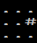

# Snakelike Retrospective

*Snakelike*, as its name suggests, is a genre mashup of *Snake* games and the roguelike genre. The goal of the game is to descend to the 20th level, eat the golden apple, and return to the surface. This document will offer some insight on the technical behind-the-scenes of the game – how I achieved certain effects, and the challenges I faced. It will also cover some of the game's mechanics and the reasoning behind their design.

You can download the game on [itch.io](https://leo-li.itch.io/snakelike) or watch gameplay [here](https://youtu.be/0FIhjqivlkU).

## Levels

A level contains data on all the tiles of the map. Each tile has a **terrain** (wall, floor, stairs) and a possible **entity** (food, a potion, a piece of the snake's body, etc.), and each level holds this information.

### Level Generation

The layout of a level is generated rather simply. First, the level is initialized by setting every tile's terrain to be a wall. The rooms and pathways are then carved into these walls.

Rooms of variable dimensions are placed randomly on the level. Each new room is connected to the last with a corridor of random width. These random values are, of course, bounded within a range, as are all other random values used in the code. When all the rooms and corridors are placed, a few more corridors are added for good measure.

Stairs going up and stairs going down are randomly placed in two distinct rooms. Stairs are not placed on tiles where the player might be forced to move into it to get somewhere else. A prospective tile is checked by looking at the 3 by 3 square of tiles surrounding the stairs. If the placement of the stairs would block a path from one of the tiles in the square to another tile in the square, a different tile for the stairs is chosen. Tiles adjacent to other entities or stairs are also considered unsuitable.

After the terrain of the level is set, food and potions are randomly placed in the rooms. Using the same process as the placement of stairs, these entities are not placed on tiles that might block pathways.

> Consider the following 3 by 3 squares of tiles:     
>  
> The centre tiles of the first two examples are valid tiles for placing stairs, food, and potions. The centre tiles of the following three examples are not.

## Vision

There's no opportunity for exploration if the player enters a level with full knowledge of its layout.  Thus, levels are initially shrouded in darkness, leaving the player to discover its secrets by moving about. Any tiles within the player's field of vision, a "circle" centred around the player (more accurately, a diamond), is permanently added to their map of that level.

> Aside: As the level only changes as a result of a player action (for example, eating food changes the level by removing the food from that tile), there are no events that occur without the player's knowledge as might happen in other roguelikes (such as an enemy moving around outside of the player's field of vision). Thus, there is no distinction between tiles that the player has seen and tiles and the player can currently see. A tile is either be visible to the player or not.

Simulating vision is not as simple as adding every tile within range to the player's map – the player shouldn't see tiles that are obscured behind walls. To determine which tiles should be seen, a version of Bresenham's line algorithm was employed. Specifically, for each tile on the perimeter of the vision field, a line from player to tile was calculated. For each line, travelling from player to edge of the vision field, tiles were revealed sequentially until the line reached its end or it hit a wall. Essentially, this method casts rays in all directions.

This was the initial implementation, and while it worked well enough, it resulted in an unacceptable frequency of dark tiles that should be visible. These artifacts are a natural consequence of this method of vision simulation.

To fix this, one can perform a second set of ray casts to the non-visible tiles within the field of vision to patch up the holes. This guarantees that tiles that should be seen are seen.

## Increasing Difficulty

As the player traverses deeper into the depths, they face more challenges. Rooms grow smaller and more tightly packed together and corridors narrow. This cramped feeling is exacerbated by a decreasing vision radius. Combined with the fact that eating food decreases speed, these elements incentivize players to explore levels in search of food, so that they can give themselves enough time to react when winding around the tunnels of the deepest and darkest levels. These mechanics mean that making a snakeline for the stairs heading down isn't always the obvious choice to make. Players must weigh their options carefully: do they explore more of the current level and risk taking damage, or do they abandon the food and potions that may lie hidden in uncharted territory?

## Looking Back

*Snakelike*'s code is by no means perfect. It began as what I thought would be a small and quick project, and the scope slowly grew as I had more ideas and modified the game design.

The way level stores data on tiles could benefit from some refactoring should the game be expanded further – as they are, a `Level` struct contains four "layers" of the map for terrain, entities, visibility status, and visual effects. If this information was tied to a `Tile` struct, the level could instead hold one layer of tiles, which I suspect would be easier to manage.

Overall, I'm very happy with the results of this project and I believe I accomplished what I set out to achieve. I'd wanted to make a roguelike for a while and *Snakelike* is, I think, a unique contribution to this fun-yet-frustrating genre.

## Helpful Resources

The development of this game would not have been possible without the wisdom of others. Here are links to some of the resources I found useful:

[Roguelike Vision Algorithms](http://www.adammil.net/blog/v125_roguelike_vision_algorithms.html)
 
[RogueBasin](http://www.roguebasin.com/index.php?title=Field_of_Vision)